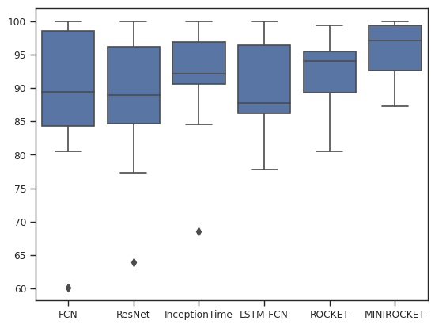

# Fall Detection

Empirical study of TSC SOTA models on the FallAllD dataset

## Setup

For the most convenience, the code can be run using Google Colab by downloading the repository to Google Drive and working from there. In case of using a local environment, the libraries in the [requirements.txt](https://github.com/almasrifi-rami/fall_detection/blob/main/requirements.txt) need to be installed.

Also, the data need to be downloaded from [IEEDataPort](https://ieee-dataport.org/open-access/fallalld-comprehensive-dataset-human-falls-and-activities-daily-living), then processed using [FallAllD_to_PYTHON_Structure.py](https://github.com/almasrifi-rami/fall_detection/blob/main/src/utils/FallAllD_to_PYTHON_Structure.py) to create a pickle file which can be used for loading the data and training the model.

## Data Loading

After processing the data files using [FallAllD_to_PYTHON_Structure.py](https://github.com/almasrifi-rami/fall_detection/blob/main/src/utils/FallAllD_to_PYTHON_Structure.py), the data can be loaded using two functions from [utils.utils.py](https://github.com/almasrifi-rami/fall_detection/blob/main/src/utils/utils.py) module:

1. [load_df()](https://github.com/almasrifi-rami/fall_detection/blob/1e78539ef9c9c4ccbd2705dc7fa16851039e0f57/src/utils/utils.py#L25) for loading the data into a pandas DataFrame for data exploration and analysis
2. [load_data()](https://github.com/almasrifi-rami/fall_detection/blob/1e78539ef9c9c4ccbd2705dc7fa16851039e0f57/src/utils/utils.py#L194) for loading the data into a format suitable for most machine learning models using tensorflow (instances, timesteps, variables)

## Models

6 models were used in total and the code are provided in [utils.models.py](https://github.com/almasrifi-rami/fall_detection/blob/main/src/utils/models.py). The models used are FCN, ResNet, InceptionTime, LSTM-FCN, ROCKET, and MINIROCKET, all of which achieve state-of-the-art (SOTA) performance on time series classification (TSC) tasks.

## Results

An average accuracy of approx. 95% across all samples can be achieved by using MINIROCKET to transform the data then fitting a linear classifier such as ridge regression classifier. The descriptive statistics of the models accuracies across samples suggest that some models perform better than others on the fall detection problem. Friedman's test results in p-value = 0.007 < 0.05 which also contributes to the conclusion that the models performances are different from one another.



However, after comparing the results with Wilcoxon's signed rank test with Holm's method, we accept the null hypothesis. This means that there is no statistically significant difference in the median of accuracy between the models or that the test does not have enough power to detect the difference.


|Model\_1|Model\_2|p\_value|H0 \(Holm-Wilcoxon\)|
|---|---|---|---|
|ResNet|MINIROCKET|0\.00443|Accept|
|LSTM-FCN|MINIROCKET|0\.00443|Accept|
|FCN|MINIROCKET|0\.00963|Accept|
|ResNet|InceptionTime|0\.01636|Accept|
|FCN|InceptionTime|0\.04685|Accept|
|ROCKET|MINIROCKET|0\.06811|Accept|
|InceptionTime|MINIROCKET|0\.08437|Accept|
|ResNet|ROCKET|0\.09423|Accept|
|InceptionTime|LSTM-FCN|0\.11666|Accept|
|FCN|ROCKET|0\.13609|Accept|
|LSTM-FCN|ROCKET|0\.16772|Accept|
|FCN|ResNet|0\.72210|Accept|
|FCN|LSTM-FCN|0\.81394|Accept|
|ResNet|LSTM-FCN|0\.81394|Accept|
|InceptionTime|ROCKET|0\.93747|Accept|

## References

### Data

The data used in this work was downloaded from [IEEDataPort](https://ieee-dataport.org/open-access/fallalld-comprehensive-dataset-human-falls-and-activities-daily-living).

```
@data{bnya-mn34-20,
doi = {10.21227/bnya-mn34},
url = {https://dx.doi.org/10.21227/bnya-mn34},
author = {SALEH, Majd and LE BOUQUIN JEANNES, Régine},
publisher = {IEEE Dataport},
title = {FallAllD: A Comprehensive Dataset of Human Falls and Activities of Daily Living},
year = {2020} }
```

### Models

The models used in this work are adapted from the code of the following papers.

1. FCN + ResNet

```
@misc{wang2016time,
      title={Time Series Classification from Scratch with Deep Neural Networks: A Strong Baseline}, 
      author={Zhiguang Wang and Weizhong Yan and Tim Oates},
      year={2016},
      eprint={1611.06455},
      archivePrefix={arXiv},
      primaryClass={cs.LG}
}
```

```
@article{Ismail_Fawaz_2019,
   title={Deep learning for time series classification: a review},
   volume={33},
   ISSN={1573-756X},
   url={http://dx.doi.org/10.1007/s10618-019-00619-1},
   DOI={10.1007/s10618-019-00619-1},
   number={4},
   journal={Data Mining and Knowledge Discovery},
   publisher={Springer Science and Business Media LLC},
   author={Ismail Fawaz, Hassan and Forestier, Germain and Weber, Jonathan and Idoumghar, Lhassane and Muller, Pierre-Alain},
   year={2019},
   month=mar, pages={917–963} }
```

2. InceptionTime

```
@article{Ismail_Fawaz_2020,
   title={InceptionTime: Finding AlexNet for time series classification},
   volume={34},
   ISSN={1573-756X},
   url={http://dx.doi.org/10.1007/s10618-020-00710-y},
   DOI={10.1007/s10618-020-00710-y},
   number={6},
   journal={Data Mining and Knowledge Discovery},
   publisher={Springer Science and Business Media LLC},
   author={Ismail Fawaz, Hassan and Lucas, Benjamin and Forestier, Germain and Pelletier, Charlotte and Schmidt, Daniel F. and Weber, Jonathan and Webb, Geoffrey I. and Idoumghar, Lhassane and Muller, Pierre-Alain and Petitjean, François},
   year={2020},
   month=sep, pages={1936–1962} }
```

3. LSTM-FCN

```
@article{Karim_2019,
   title={Multivariate LSTM-FCNs for time series classification},
   volume={116},
   ISSN={0893-6080},
   url={http://dx.doi.org/10.1016/j.neunet.2019.04.014},
   DOI={10.1016/j.neunet.2019.04.014},
   journal={Neural Networks},
   publisher={Elsevier BV},
   author={Karim, Fazle and Majumdar, Somshubra and Darabi, Houshang and Harford, Samuel},
   year={2019},
   month=aug, pages={237–245} }
```

4. ROCKET

```
@article{Dempster_2020,
   title={ROCKET: exceptionally fast and accurate time series classification using random convolutional kernels},
   volume={34},
   ISSN={1573-756X},
   url={http://dx.doi.org/10.1007/s10618-020-00701-z},
   DOI={10.1007/s10618-020-00701-z},
   number={5},
   journal={Data Mining and Knowledge Discovery},
   publisher={Springer Science and Business Media LLC},
   author={Dempster, Angus and Petitjean, François and Webb, Geoffrey I.},
   year={2020},
   month=jul, pages={1454–1495} }
```

5. MINIROCKET

```
@inproceedings{Dempster_2021, series={KDD ’21},
   title={MiniRocket: A Very Fast (Almost) Deterministic Transform for Time Series Classification},
   url={http://dx.doi.org/10.1145/3447548.3467231},
   DOI={10.1145/3447548.3467231},
   booktitle={Proceedings of the 27th ACM SIGKDD Conference on Knowledge Discovery &amp; Data Mining},
   publisher={ACM},
   author={Dempster, Angus and Schmidt, Daniel F. and Webb, Geoffrey I.},
   year={2021},
   month=aug, collection={KDD ’21} }
```
